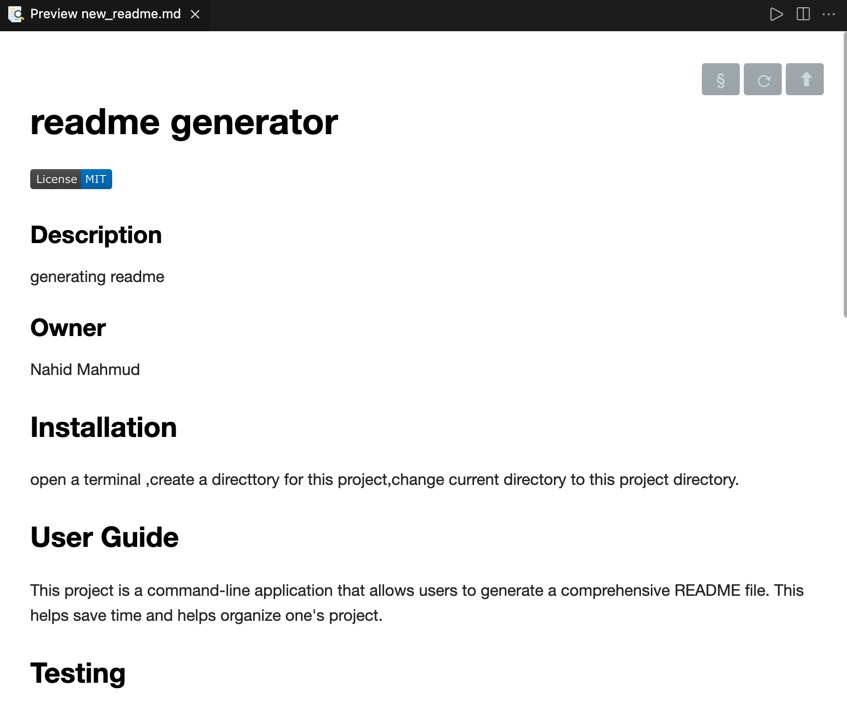

# readme_generator

## Description

This project is a command-line application that allows users to generate a comprehensive README file. This helps save time and helps organize one's project.

## Installlation

please clone the git repository :git@github.com:Nahid1010/readme_generator.git

After cloning open a terminal and run npm i inquirer to install the package.

## Testing

code- git@github.com:Nahid1010/readme_generator.git
live - https://nahid1010.github.io/readme_generator/
-here is a screenshot

